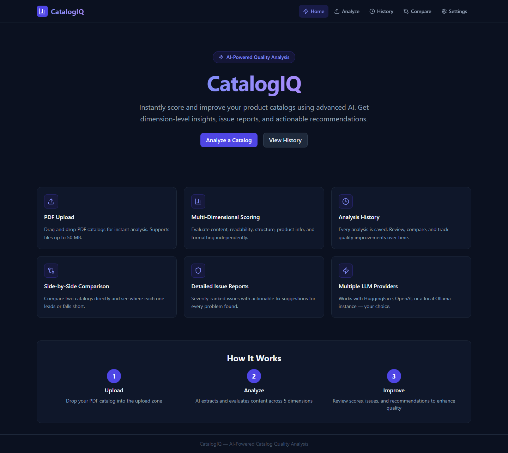
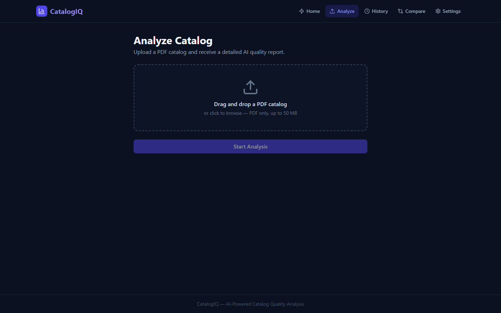
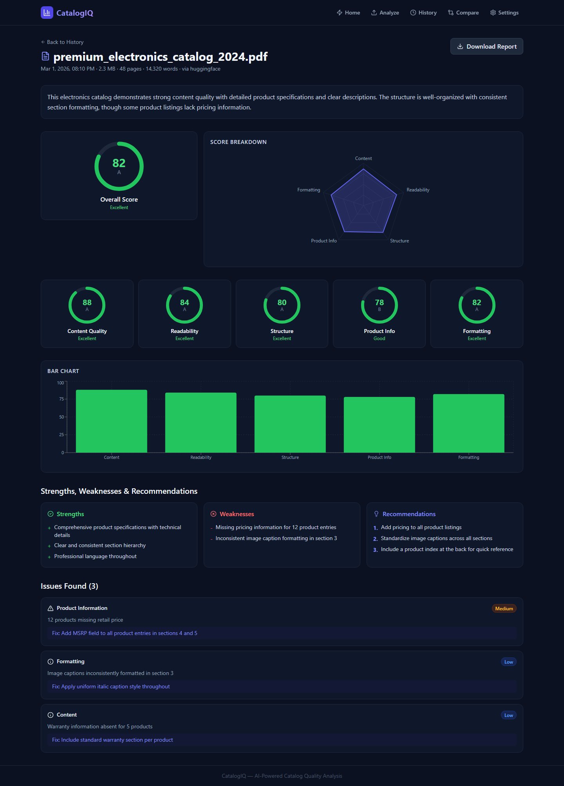
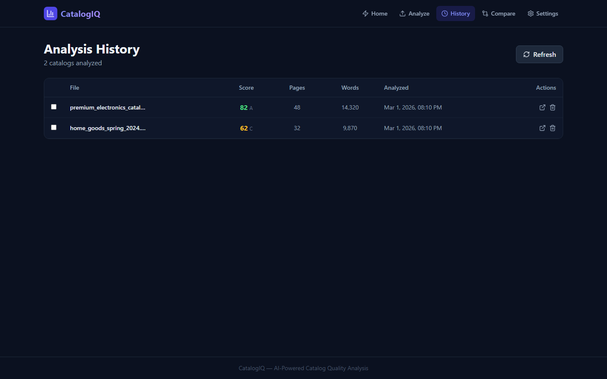
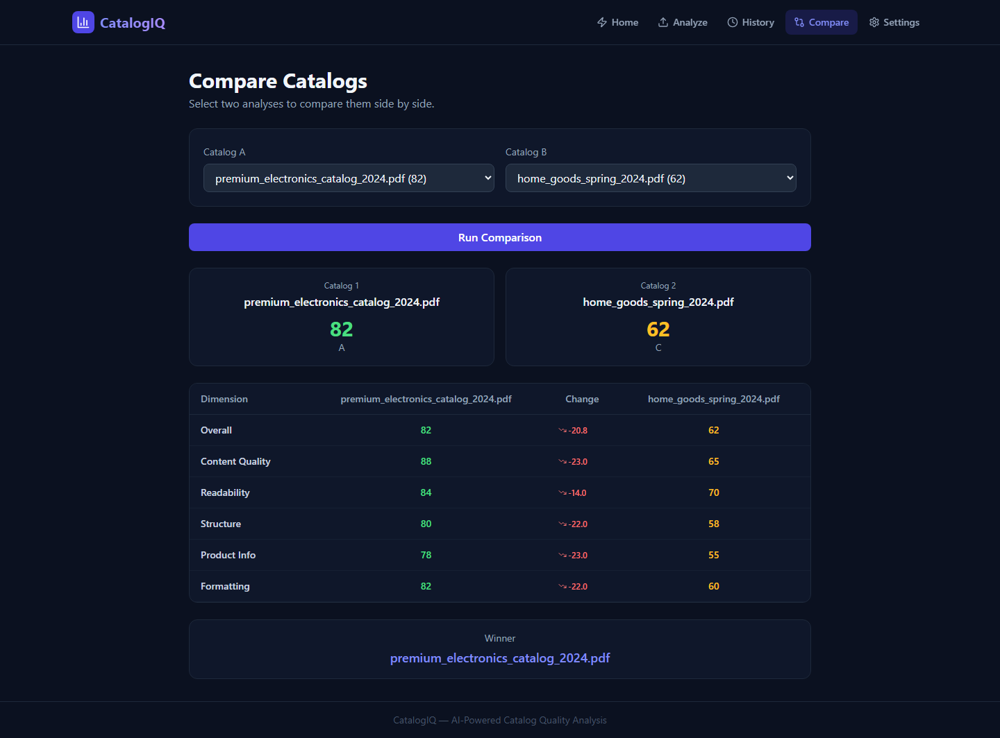
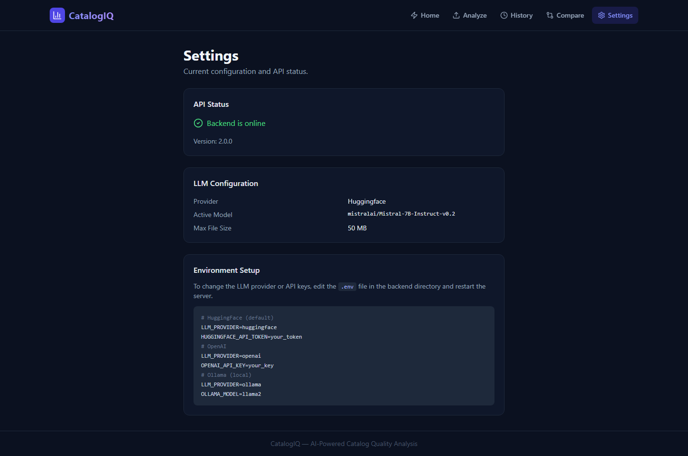
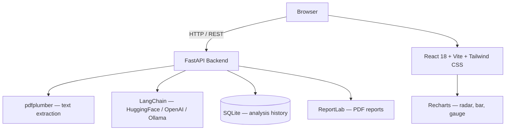

# CatalogIQ — AI Catalog Quality Scorer

<div align="center">

**Instantly score and improve your product catalogs using AI.**
Upload any PDF, get a detailed quality breakdown across five dimensions, and export a full report.

[](https://www.python.org/)
[](https://fastapi.tiangolo.com/)
[](https://react.dev/)
[](https://tailwindcss.com/)
[](https://langchain.com/)
[](LICENSE)

</div>

---

## What It Does

CatalogIQ reads a PDF catalog and uses an LLM to evaluate it across five independent quality dimensions. Each dimension receives a score from 0–100. The platform identifies specific issues (ranked by severity), lists concrete recommendations, and generates a downloadable PDF report — all in one workflow.

Works with **HuggingFace** (free), **OpenAI**, or a **local Ollama** instance.

---

## Screenshots

<table>
  <tr>
    <td align="center"><b>Home</b></td>
    <td align="center"><b>Upload & Analyze</b></td>
  </tr>
  <tr>
    <td></td>
    <td></td>
  </tr>
  <tr>
    <td align="center"><b>Results Dashboard</b></td>
    <td align="center"><b>Analysis History</b></td>
  </tr>
  <tr>
    <td></td>
    <td></td>
  </tr>
  <tr>
    <td align="center"><b>Side-by-Side Comparison</b></td>
    <td align="center"><b>Settings</b></td>
  </tr>
  <tr>
    <td></td>
    <td></td>
  </tr>
</table>

---

## Features

| Feature | Details |
|---|---|
| **5-Dimension AI Scoring** | Content Quality, Readability, Structure, Product Information, and Formatting — each 0–100 |
| **Issue Detection** | Severity-ranked issues (High / Medium / Low) with a targeted fix suggestion for each |
| **Visual Dashboards** | Circular score gauge, radar chart, and bar chart generated client-side |
| **Catalog Comparison** | Select any two past analyses and get a dimension-level diff with a winner |
| **PDF Report Export** | Download a formatted ReportLab report with scores, issues, and recommendations |
| **Analysis History** | Every run persisted in SQLite — browse, re-read, or delete any time |
| **Multi-Provider LLM** | Swap between HuggingFace, OpenAI GPT, or Ollama with a single env variable |
| **Drag-and-Drop Upload** | PDF files up to 50 MB, validated before processing |
| **Docker Support** | Spin up frontend + backend in one `docker-compose up` |
| **REST API + Swagger** | Full API at `/api` with interactive docs at `/api/docs` |

---

## Scoring Dimensions

```
Content Quality      — Grammar, factual accuracy, completeness of information
Readability          — Sentence clarity, language accessibility, reading ease
Structure & Org.     — Logical flow, section hierarchy, consistent categorization
Product Information  — Specs, pricing, SKUs, dimensions, and descriptions
Formatting Quality   — Visual consistency, layout coherence, typographic uniformity
```

The overall score is the equal-weighted mean of the five dimensions.

---

## Architecture



---

## Tech Stack

| Layer | Technology | Version |
|---|---|---|
| Frontend | React, Vite, Tailwind CSS | 18 / 5 / 3.4 |
| Charts | Recharts | 2.12 |
| Routing | React Router | v6 |
| HTTP Client | Axios | 1.7 |
| File Upload | react-dropzone | 14 |
| Backend | FastAPI, Uvicorn | 0.111 / 0.29 |
| ORM | SQLAlchemy, Pydantic v2 | 2.0 / 2.7 |
| PDF Parsing | pdfplumber | 0.11 |
| AI / LLM | LangChain + providers | 0.2 |
| Reports | ReportLab | 4.1 |
| Database | SQLite | — |
| Containers | Docker, Compose | — |

---

## Quick Start

### Requirements

- Python 3.8+
- Node.js 20+
- A free [HuggingFace token](https://huggingface.co/settings/tokens) **or** an OpenAI key **or** a running [Ollama](https://ollama.com/) instance

### 1 — Backend

```bash
cd backend
cp .env.example .env        # then edit .env and add your token
pip install -r requirements.txt
python run.py
```

API ready at **http://localhost:8000** — interactive docs at **http://localhost:8000/docs**

### 2 — Frontend

```bash
cd frontend
npm install
npm run dev
```

Open **http://localhost:5173**

### 3 — Docker (full stack)

```bash
cp backend/.env.example backend/.env   # add your token
docker-compose up --build
```

---

## LLM Configuration

Edit `backend/.env` to choose a provider:

```env
# HuggingFace  (default — free tier available)
LLM_PROVIDER=huggingface
HUGGINGFACE_API_TOKEN=hf_xxxxxxxxxxxxxxxx
HUGGINGFACE_MODEL=mistralai/Mistral-7B-Instruct-v0.2

# OpenAI
LLM_PROVIDER=openai
OPENAI_API_KEY=sk-xxxxxxxxxxxxxxxx
OPENAI_MODEL=gpt-3.5-turbo

# Ollama  (fully local, no API key needed)
LLM_PROVIDER=ollama
OLLAMA_BASE_URL=http://localhost:11434
OLLAMA_MODEL=llama2
```

---

## API Reference

| Method | Endpoint | Description |
|---|---|---|
| `POST` | `/api/analyses/` | Upload a PDF and run an analysis |
| `GET` | `/api/analyses/` | List all analyses (paginated) |
| `GET` | `/api/analyses/{id}` | Retrieve a full analysis result |
| `DELETE` | `/api/analyses/{id}` | Delete an analysis |
| `POST` | `/api/analyses/compare` | Compare two analyses side-by-side |
| `GET` | `/api/analyses/{id}/report` | Download analysis as a PDF report |
| `GET` | `/api/health` | Backend health and version |
| `GET` | `/api/config` | Active LLM provider and settings |

Full interactive Swagger UI at `http://localhost:8000/docs`.

---

## Project Structure

```
catalog-quality-scorer/
├── backend/
│   ├── app/
│   │   ├── main.py               FastAPI application and CORS setup
│   │   ├── config.py             Pydantic-settings — all env variables
│   │   ├── database.py           SQLAlchemy engine and session factory
│   │   ├── models/analysis.py    ORM model for stored analyses
│   │   ├── schemas/analysis.py   Request / response Pydantic schemas
│   │   ├── api/routes/
│   │   │   ├── analysis.py       CRUD + compare + report endpoints
│   │   │   └── health.py         Health and config endpoints
│   │   └── services/
│   │       ├── pdf_service.py    pdfplumber text and metadata extraction
│   │       ├── analyzer.py       LLM prompt, JSON parsing, score clamping
│   │       └── report_service.py ReportLab PDF report generation
│   ├── requirements.txt
│   ├── .env.example
│   ├── Dockerfile
│   └── run.py
├── frontend/
│   ├── src/
│   │   ├── pages/                Home  Analyze  Results  History  Compare  Settings
│   │   ├── components/
│   │   │   ├── analysis/         ScoreCard  ScoreChart  AnalysisDetails  IssuesList
│   │   │   ├── compare/          CompareView with diff table
│   │   │   ├── history/          HistoryTable with select-to-compare
│   │   │   ├── layout/           Navbar  Layout
│   │   │   └── upload/           UploadZone (react-dropzone)
│   │   ├── services/api.js       Axios API client
│   │   └── utils/helpers.js      Score colours, grades, formatters
│   ├── package.json
│   ├── vite.config.js
│   ├── tailwind.config.js
│   ├── Dockerfile
│   └── nginx.conf
├── docker-compose.yml
└── README.md
```

---

## Origin

Complete rewrite of the original [Catalouge-Scorer](https://github.com/punyamodi/catalog-quality-scorer/tree/legacy) Streamlit prototype (single-file, PyPDF2, Mistral-7B). Legacy code preserved on the [`legacy`](https://github.com/punyamodi/catalog-quality-scorer/tree/legacy) branch.

---

## License

[MIT](LICENSE)

