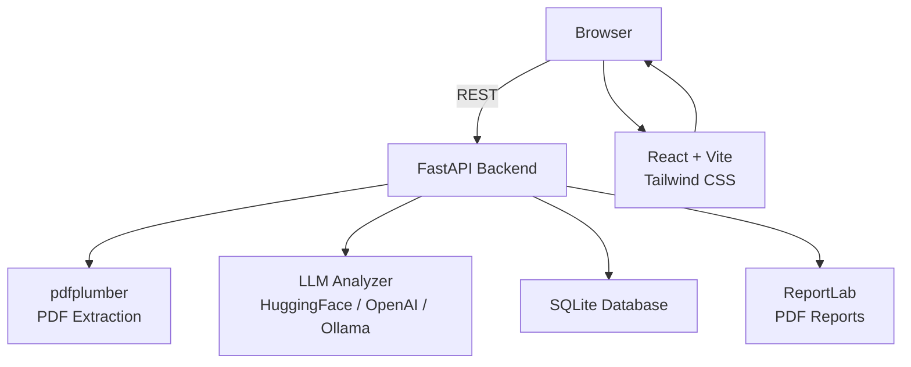

# CatalogIQ

**AI-powered catalog quality analysis platform.** Upload any PDF catalog and receive a detailed quality score across five dimensions — with issue reports, recommendations, and side-by-side comparison.

---

## Features

- **Multi-dimensional scoring** — Content Quality, Readability, Structure, Product Information, and Formatting, each scored 0–100
- **Radar and bar charts** — Visual score breakdowns that make weaknesses immediately obvious
- **Issue reports** — Severity-ranked issues (High / Medium / Low) with actionable fix suggestions
- **Analysis history** — Every run is stored in SQLite; browse, revisit, and delete past analyses
- **Catalog comparison** — Select any two analyses from history and compare them side by side
- **PDF report export** — Download a full report as a formatted PDF
- **Multiple LLM providers** — Works with HuggingFace (default), OpenAI GPT, or a local Ollama instance
- **Drag-and-drop upload** — PDF files up to 50 MB
- **Docker support** — Spin up the full stack with a single command

---

## Architecture



---

## Tech Stack

| Layer | Technology |
|---|---|
| Frontend | React 18, Vite, Tailwind CSS, Recharts, React Router v6 |
| Backend | FastAPI, SQLAlchemy, Pydantic v2, Python 3.11 |
| PDF Processing | pdfplumber |
| AI Analysis | LangChain, HuggingFace / OpenAI / Ollama |
| Report Generation | ReportLab |
| Database | SQLite |
| Containerization | Docker, Docker Compose |

---

## Scoring Dimensions

| Dimension | What is evaluated |
|---|---|
| Content Quality | Grammar, factual accuracy, completeness of written content |
| Readability | Sentence clarity, language accessibility, reading ease |
| Structure & Organization | Logical flow, section hierarchy, categorization |
| Product Information | Completeness of specs, pricing, descriptions, SKUs |
| Formatting Quality | Visual consistency, layout coherence, typographic uniformity |

---

## Getting Started

### Prerequisites

- Python 3.11+
- Node.js 20+
- A HuggingFace API token (free) **or** an OpenAI key **or** a running Ollama instance

### Backend setup

```bash
cd backend
cp .env.example .env
# Edit .env and add your HUGGINGFACE_API_TOKEN
pip install -r requirements.txt
python run.py
```

The API will be available at `http://localhost:8000`. Interactive docs at `http://localhost:8000/docs`.

### Frontend setup

```bash
cd frontend
npm install
npm run dev
```

Open `http://localhost:5173` in your browser.

### Docker (full stack)

```bash
cp backend/.env.example backend/.env
# Add your API token to backend/.env
docker-compose up --build
```

Frontend: `http://localhost:5173` | Backend: `http://localhost:8000`

---

## LLM Configuration

Edit `backend/.env` to switch providers:

```env
# HuggingFace (default, free tier available)
LLM_PROVIDER=huggingface
HUGGINGFACE_API_TOKEN=hf_your_token_here
HUGGINGFACE_MODEL=mistralai/Mistral-7B-Instruct-v0.2

# OpenAI
LLM_PROVIDER=openai
OPENAI_API_KEY=sk-your_key_here
OPENAI_MODEL=gpt-3.5-turbo

# Ollama (local, no API key required)
LLM_PROVIDER=ollama
OLLAMA_BASE_URL=http://localhost:11434
OLLAMA_MODEL=llama2
```

---

## API Reference

| Method | Endpoint | Description |
|---|---|---|
| `POST` | `/api/analyses/` | Upload and analyze a PDF |
| `GET` | `/api/analyses/` | List all past analyses |
| `GET` | `/api/analyses/{id}` | Get a specific analysis |
| `DELETE` | `/api/analyses/{id}` | Delete an analysis |
| `POST` | `/api/analyses/compare` | Compare two analyses |
| `GET` | `/api/analyses/{id}/report` | Download PDF report |
| `GET` | `/api/health` | Health check |
| `GET` | `/api/config` | Active configuration |

Full interactive docs available at `http://localhost:8000/docs` when the backend is running.

---

## Project Structure

```
catalogiq/
├── backend/
│   ├── app/
│   │   ├── main.py              FastAPI app and middleware
│   │   ├── config.py            Settings and environment variables
│   │   ├── database.py          SQLAlchemy engine and session
│   │   ├── models/analysis.py   Database model
│   │   ├── schemas/analysis.py  Pydantic request/response schemas
│   │   ├── api/routes/          API route handlers
│   │   └── services/            PDF extraction, LLM analysis, reporting
│   ├── requirements.txt
│   ├── .env.example
│   └── run.py
├── frontend/
│   ├── src/
│   │   ├── pages/               Home, Analyze, Results, History, Compare, Settings
│   │   ├── components/          Layout, Upload, Charts, Analysis, History, Compare
│   │   ├── services/api.js      Axios API client
│   │   └── utils/helpers.js     Formatting and scoring utilities
│   ├── package.json
│   └── vite.config.js
├── docker-compose.yml
└── README.md
```

---

## Origin

This project is a complete rewrite of the original Catalouge-Scorer Streamlit prototype. The original single-file app used PyPDF2 and Mistral-7B on HuggingFace. The legacy code is preserved on the [`legacy`](https://github.com/punyamodi/catalogiq/tree/legacy) branch.

---

## License

MIT
